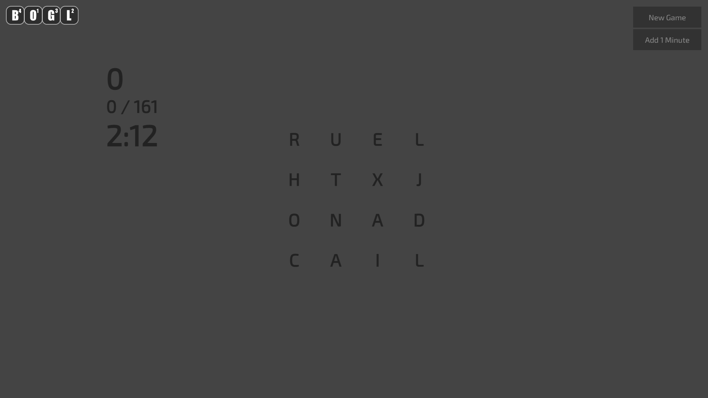
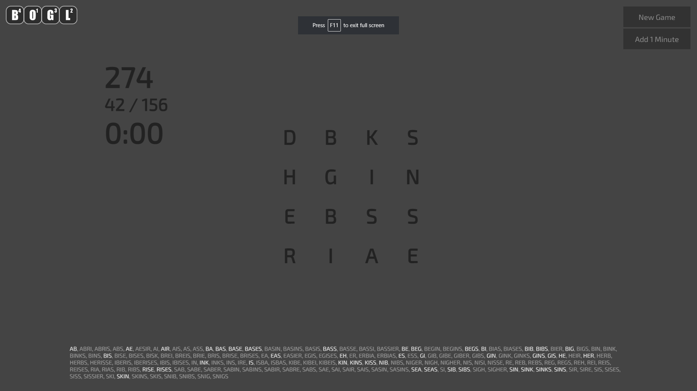

# BOGL

This is a fully functional [Boggle®](http://en.wikipedia.org/wiki/Boggle) clone written in vanilla JavaScript. It uses a local, client-side copy of the [*Official Scrabble® Players Dictionary*](https://scrabble.hasbro.com/en-us/tools), and the letter distribution on the dice is the classic version. See [this link](http://www.bananagrammer.com/2013/10/the-boggle-cube-redesign-and-its-effect.html) for a comparison between the 1976 "classic" version and the newer distributions.

### [Play Here](https://bo-gl.netlify.app/).

## Script Abstract:
1. Gameboard generation: random selection
1. Find all possible words on gameboard: linked list and binary search
1. Timer with adjustable settings
1. Scoring based on letter value and word length
1. Show possible words, highlighting words found

## Screenshots
<figure>
<figcaption>Gameplay: NB animations not shown</figcaption>

</figure>

<figure>
<figcaption>Game Over: Shows possible and made</figcaption>

## License

[CC BY 4.0](https://creativecommons.org/licenses/by/4.0/)